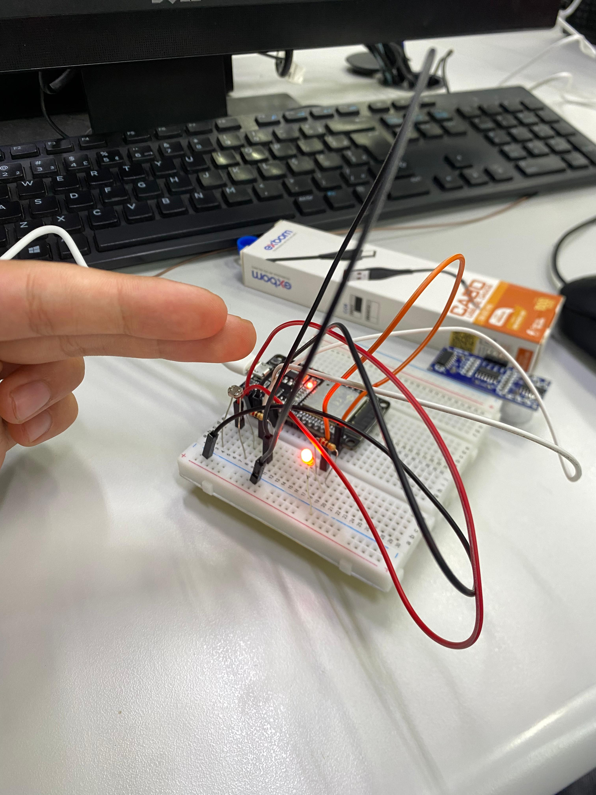
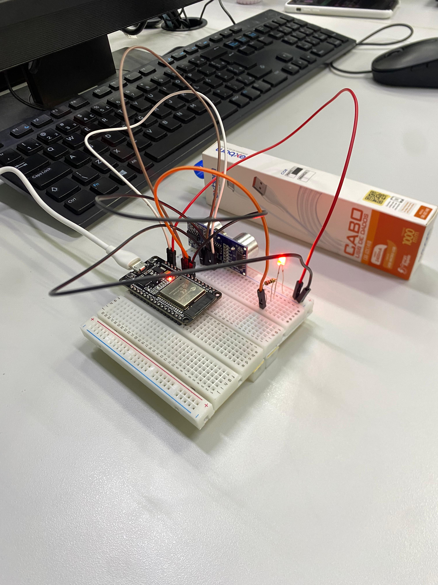
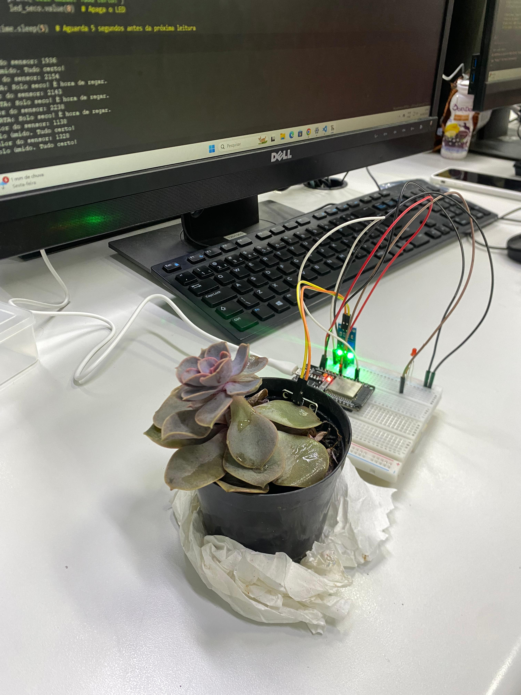
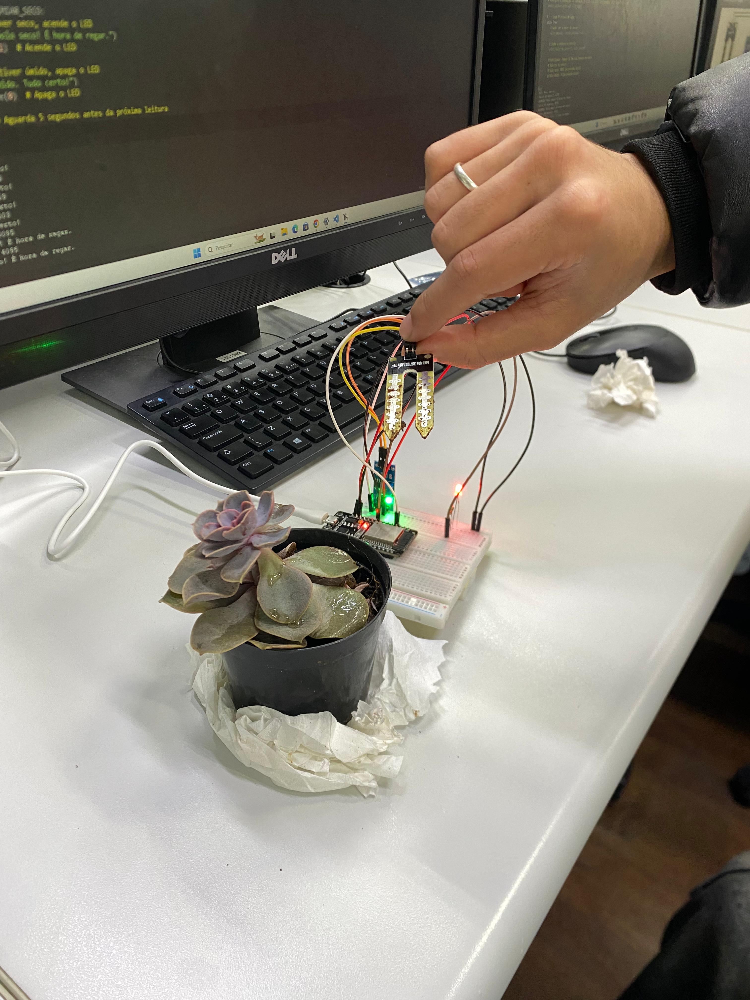
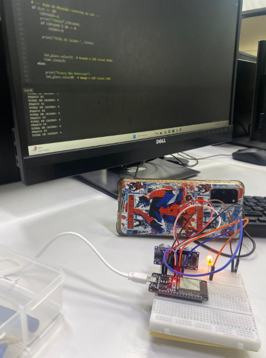

# Projeto Sensores - IOT

## Sobre 
Esses foram projetos de circuitos utilizando diferentes sensores com o intuito de colocar em prática o conhecimento adquirido nas aulas de IOT, durante o curso técnico de **Desenvolvimento de Sistemas** do [SENAI Jandira](https://sp.senai.br/unidade/jandira/).  
Nesse projeto trabalhamos com sensor de luminosidade LDR, sensor de proximidade HC-SR04 e sensor de umidade capacitivo. a montagem foi feita fisicamente, com os componentes e o código em Python.
Utilizamos o **Wokwi** para as simulações e fizemos a documentação pelo **Visual Studio Code**.

---

## Circuitos Desenvolvidos

### Sensor de luminosidade - LDR
Nesse circuito ao detectar baixa luminosidade o led acende. 

---

### Sensor de proximidade - HC-SR04
Nesse circuito ao sensor detectar algo próximo, o led acende.

---

### Sensor de umidade capacitivo
Nesse circuito o sensor detecta se há umidade ou não, e se o nível de umidade for baixo o led acende.

---

## Tecnologias Utilizadas
- **Hardware**

- Sensor de Luminosidade (LDR) 

- Sensor Ultrassônico HC-SR04 

- Sensor de Umidade Capacitivo

- LEDs 

- Resistores e Jumpers 

- Protoboard 

- Microcontrolador 

- **Software / Ferramentas**

- Python

- Wokwi 

- Visual Studio Code (VS Code) 

-  GitHub 

---

# Projeto Alpha Corp - IOT

## Sobre

Este projeto foi desenvolvido durante o curso técnico de **Desenvolvimento de Sistemas** do [SENAI Jandira](https://sp.senai.br/unidade/jandira/), como parte das aulas de **IoT**.

A proposta do desafio foi de criar um circuito que ajude a **Alpha Corp**, uma indústria de cosméticos que embala sempre **10 frascos por caixa**. Atualmente, a contagem é feita puramente por humanos, o que tem causado erros já que as esteiras estão destinando mais frascos por caixa.

O desafio foi automatizar a contagem de frascos que passam pela esteira, garantindo que cada caixa receba exatamente 10 frascos. Juntamente com a contagem de caixas que eles terão no fim do dia.

---

## Funcionamento do Circuito

* O sensor de proximidade HC-SR04 identifica quando um frasco passa pela esteira.
* Cada detecção é adicionada ao contador de frascos.
* Ao contar 10 frascos, o sistema adiciona uma caixa.
* Os LED's são apenas para melhor visualização do processo.

---

## Tecnologias Utilizadas

### **Hardware**

- Sensor **HC-SR04**
- LEDs
- Resistores e Jumpers
- Protoboard
- Microcontrolador

### **Software**

- Python
- Wokwi
- Visual Studio Code (VS Code)
- GitHub

---

## Autores
- [Gabriel Guedes](https://www.linkedin.com/in/gabriel-silva-guedes-84b507327/)
- [Thayná de Oliveira](https://www.linkedin.com/in/thayná-freire-863696297)  

